# Phase 2 — Hybrid Identity with Microsoft Entra Connect

## Overview

This phase extends the on-premises Active Directory environment created in Phase 1 into a hybrid identity architecture using Microsoft Entra ID and Microsoft Entra Connect Sync.

The objective was not simply to synchronize an Active Directory user to the cloud. The environment was designed to demonstrate controlled identity synchronization, routable user identities, Password Hash Synchronization (PHS), authentication method governance, MFA registration, validation, and real-world troubleshooting.

A dedicated Windows Server was used for Microsoft Entra Connect rather than installing synchronization services directly on the domain controller.

---

## Architecture

### On-Premises Environment

| Component | Configuration |

|---|---|

| Active Directory domain | `ad.sc300lab.test` |

| Domain Controller | `SC300-DC01` |

| Entra Connect Server | `SC300-SYNC01` |

| Client endpoints | `SC300-PC01`, `SC300-PC02` |

| Hybrid identity OU | `Hybrid-Users` |

| Internal DNS | Active Directory integrated DNS |

| External DNS forwarding | Cloudflare `1.1.1.1` |

### Cloud Identity

| Component | Configuration |

|---|---|

| Identity platform | Microsoft Entra ID |

| Verified custom domain | `corp.davidboydltd.co.uk` |

| Authentication | Password Hash Synchronization |

| MFA method | Microsoft Authenticator |

| Synchronization scope | `Hybrid-Users` OU |

| Source anchor | `mS-DS-ConsistencyGuid` |

The internal Active Directory namespace and cloud sign-in namespace are deliberately different.

Users are hosted internally within:

`ad.sc300lab.test`

while synchronized users can authenticate using the routable UPN suffix:

`corp.davidboydltd.co.uk`

This separates the internal AD namespace from the externally routable identity namespace.

---

## Design and Security Decisions

Several controls were deliberately implemented rather than accepting broad default configuration.

### Dedicated Synchronization Server

Microsoft Entra Connect Sync was installed on the dedicated member server `SC300-SYNC01`.

This keeps synchronization services separate from the domain controller and provides a clearer separation of infrastructure responsibilities.

### Controlled OU Synchronization

A dedicated organizational unit was created:

`OU=Hybrid-Users,DC=ad,DC=sc300lab,DC=test`

Microsoft Entra Connect was configured to synchronize only this OU.

This prevents the entire Active Directory environment from being automatically synchronized and provides a controlled boundary for hybrid identities.

### Routable UPN

The suffix:

`corp.davidboydltd.co.uk`

was added to the Active Directory forest and verified within Microsoft Entra ID.

Hybrid identities can therefore use the same routable UPN for on-premises and cloud authentication.

### Password Hash Synchronization

Password Hash Synchronization was selected as the authentication method.

This allows users to authenticate to Microsoft Entra ID using credentials derived from their on-premises Active Directory password while cloud authentication remains available independently of the on-premises authentication path.

---

## Entra Connect Configuration

Microsoft Entra Connect was configured using custom settings rather than accepting an unrestricted synchronization configuration.

The configuration included:

- Active Directory forest: `ad.sc300lab.test`

- Microsoft Entra verified domain: `corp.davidboydltd.co.uk`

- Synchronization scope restricted to `Hybrid-Users`

- `userPrincipalName` used for cloud sign-in

- Source anchor managed using `mS-DS-ConsistencyGuid`

- Password Hash Synchronization enabled

- Automatic synchronization enabled

- Staging mode disabled

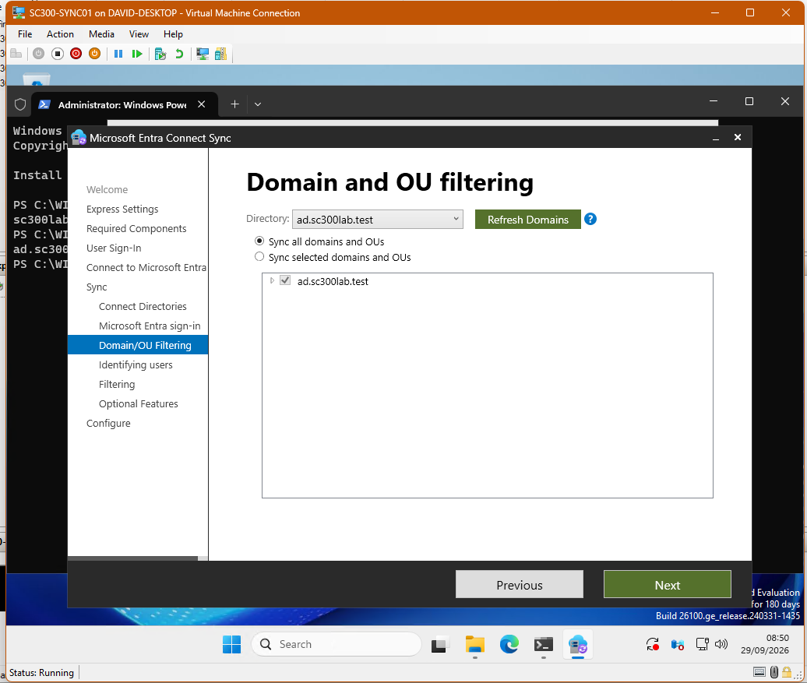

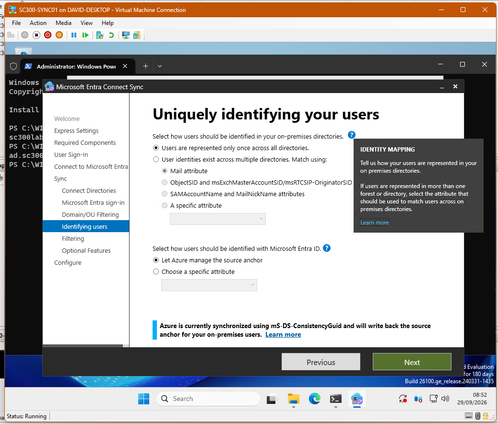

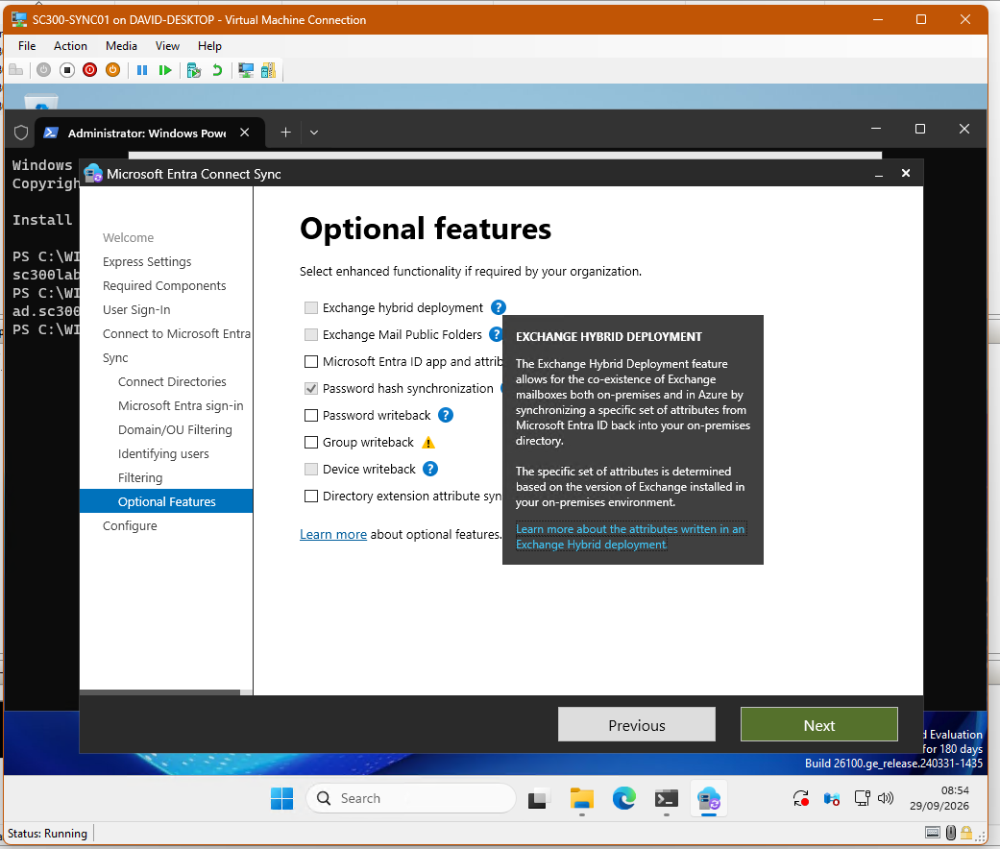

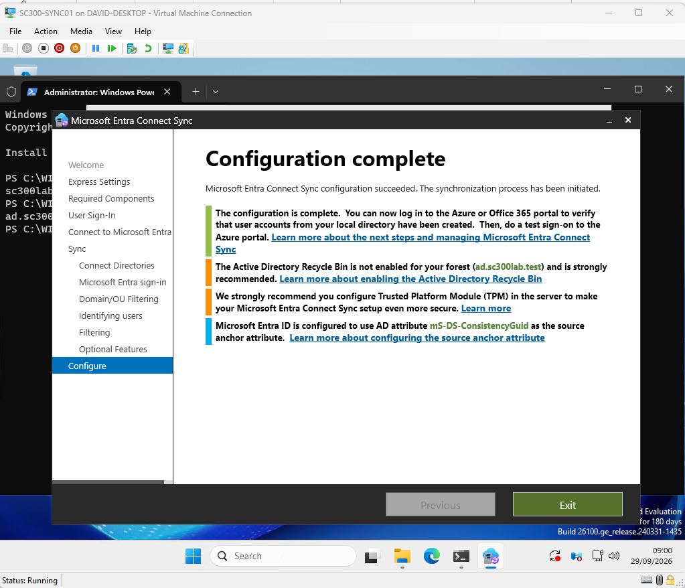

---

## Hybrid Identity Test

A test identity named **Frank Castle** was created in the controlled `Hybrid-Users` OU.

The account was configured with:

- `sAMAccountName`: `frank.castle`

- Routable UPN using `corp.davidboydltd.co.uk`

- Enabled Active Directory account

- Password change required at first sign-in

The account was first authenticated against the on-premises Active Directory environment before being validated within Microsoft Entra ID.

Following synchronization, Microsoft Entra ID showed the account as synchronized from on-premises Active Directory.

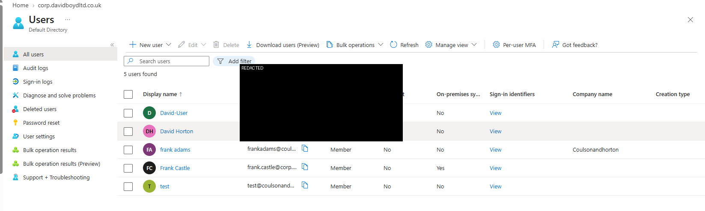

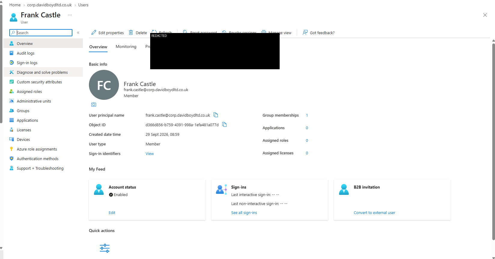

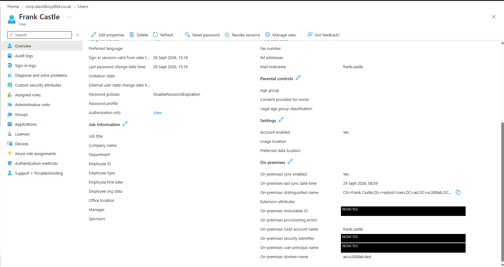

---

## Synchronization Validation

The synchronization engine was validated directly from `SC300-SYNC01`.

The scheduler confirmed:

- Synchronization enabled

- 30-minute synchronization interval

- Delta synchronization configured

- Staging mode disabled

- Scheduler not suspended

Both synchronization connectors were also confirmed:

- Active Directory connector — `ad.sc300lab.test`

- Microsoft Entra connector

Synchronization run history showed successful import, synchronization, and export operations.

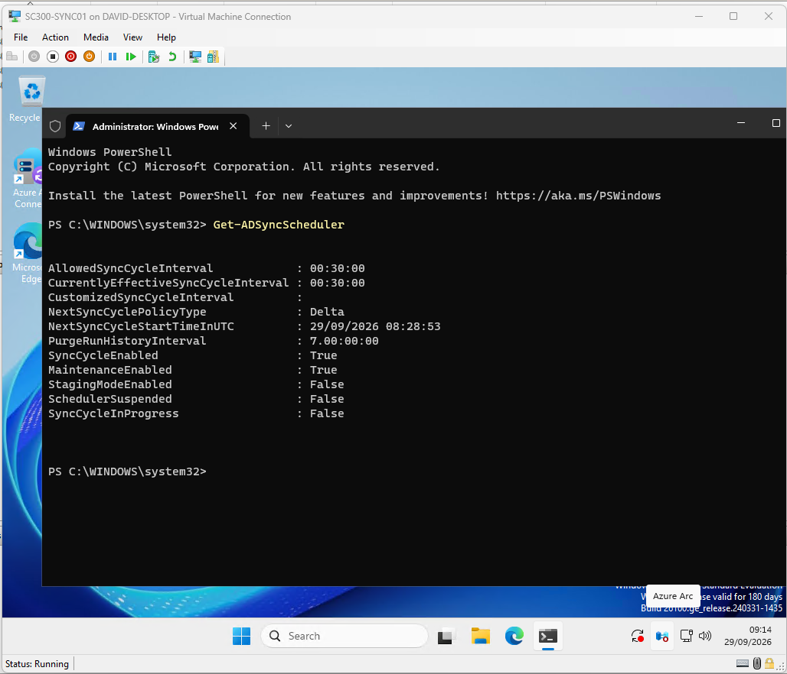

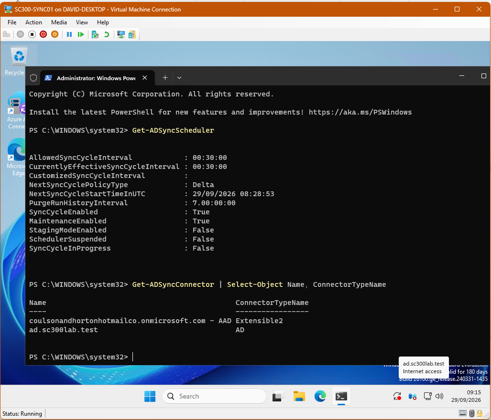

---

## Password Hash Synchronization Validation

Password Hash Synchronization was independently checked using the Microsoft Entra Connect PowerShell module.

The tenant feature configuration returned:

`PasswordHashSync : True`

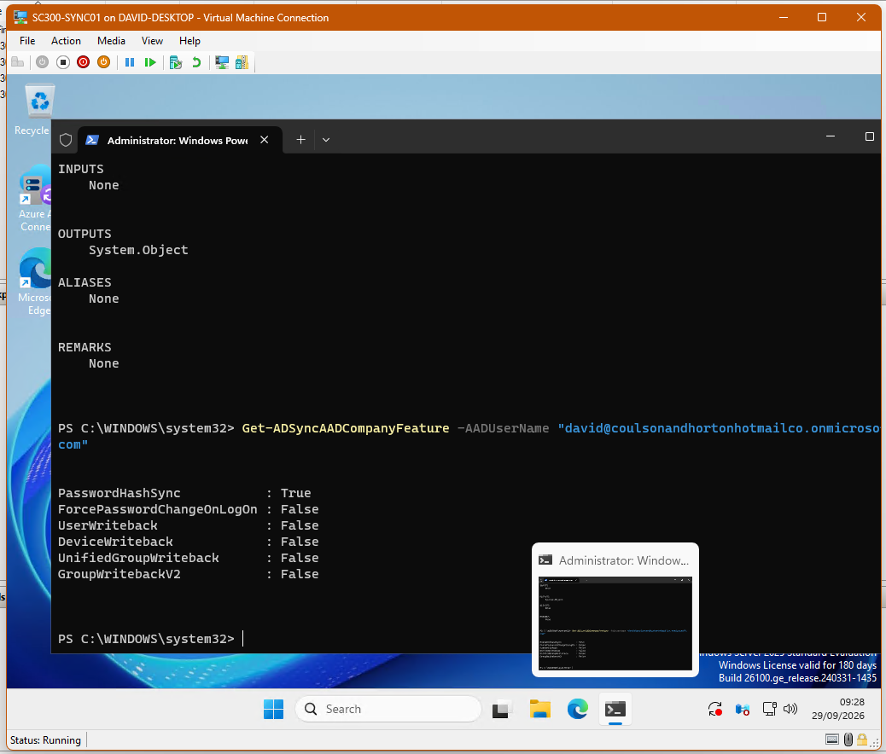

An InPrivate browser session was then used to authenticate the synchronized Frank Castle identity directly against Microsoft cloud authentication.

The current on-premises Active Directory password was accepted by Microsoft Entra ID.

Microsoft Entra sign-in diagnostics subsequently confirmed that the password authentication was successful and that the remaining interruption was caused by the requirement to register MFA under Security Defaults.

This provided end-to-end validation of the hybrid authentication flow rather than relying solely on the presence of a synchronized user object.

---

## MFA and Microsoft Authenticator

After successful password authentication, the synchronized user was required to register additional security information.

Initial Microsoft Authenticator registration failed with an:

`Unexpected error`

Both QR-code registration and manual registration were tested, which helped rule out a simple QR scanning problem.

The investigation then moved through multiple layers rather than repeatedly attempting registration.

### Authentication Method Policy

The Microsoft Entra Authentication Methods policy was reviewed.

Microsoft Authenticator was enabled for a controlled pilot group rather than immediately enabling it tenant-wide.

A security group was created:

`SG-Authentication-Authenticator-Pilot`

Frank Castle was added as the pilot user.

The Microsoft Authenticator policy was then targeted specifically at this group.

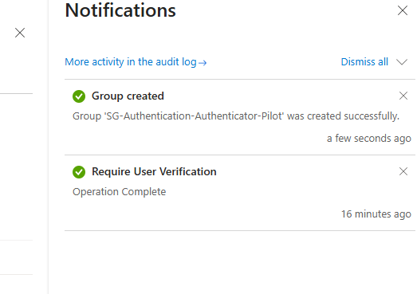

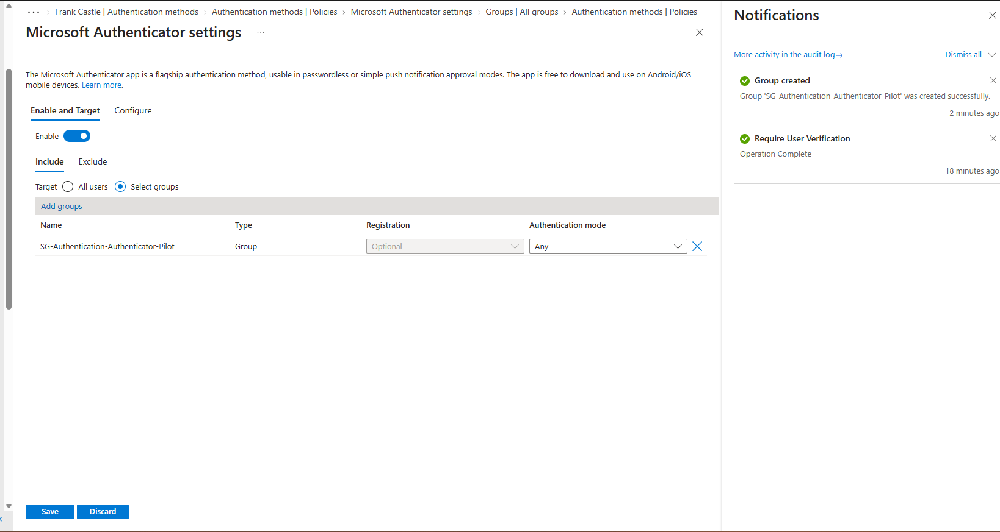

This follows a controlled rollout approach where authentication changes can be tested against a limited population before wider deployment.

---

## Security Defaults Investigation

Microsoft Entra sign-in diagnostics showed that Frank's password authentication had succeeded but the sign-in was being interrupted because MFA registration was required by Security Defaults.

Security Defaults was confirmed as enabled and was deliberately left enabled during troubleshooting.

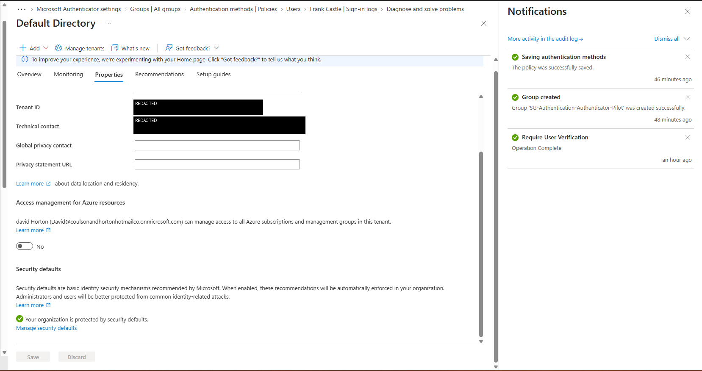

The protection was not disabled merely to make the test succeed.

A later phase of the lab will replace Security Defaults with deliberately designed Conditional Access policies once equivalent baseline protections are ready.

---

## Authenticator Client Troubleshooting

After tenant policy and account configuration had been checked, attention moved to the Microsoft Authenticator client.

The installed mobile application version was updated and registration was attempted again using a newly generated registration challenge.

The registration then completed successfully.

The final Microsoft Entra authentication-method state showed:

- Microsoft Authenticator registered

- Authenticator notification configured as the default sign-in method

- Authenticator available as a usable authentication method

- System-preferred MFA enabled

- Phone app notification selected as the system-preferred method

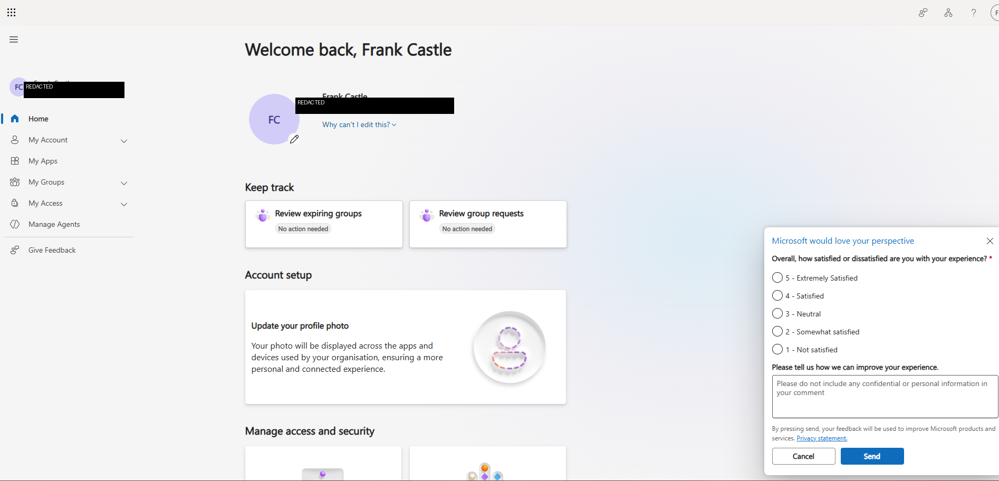

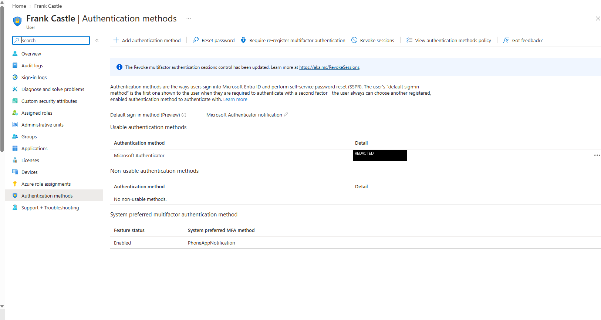

The troubleshooting process was retained as part of the portfolio because diagnosing failed identity and authentication workflows is as important as configuring the successful path.

---

## Troubleshooting Summary

This phase included several genuine implementation issues.

### Incorrect Custom Domain

An incorrect domain was initially entered during the cloud-domain configuration.

Public DNS validation returned `NXDOMAIN`, which led to verification of the domain actually under administrative control.

The configuration was corrected to:

`corp.davidboydltd.co.uk`

The required Microsoft TXT record was added to public DNS and the domain was successfully verified in Microsoft Entra ID.

### Entra Connect Security Context

Microsoft Entra Connect initially failed to automatically discover the Active Directory forest while the synchronization server session was running under a local administrator context.

Domain connectivity itself was validated separately.

The server was then accessed using the appropriate domain security context, after which the forest was discovered correctly.

### Microsoft Authenticator Registration

Password authentication succeeded, but Authenticator enrollment repeatedly returned an unexpected error.

Troubleshooting verified:

1\. Hybrid synchronization was functioning.

2\. Password Hash Synchronization was enabled.

3\. The cloud password authentication succeeded.

4\. Security Defaults required MFA registration.

5\. Microsoft Authenticator was enabled for a controlled pilot group.

6\. Both QR and manual enrollment failed.

7\. The Authenticator mobile client was updated.

8\. Registration was repeated with a fresh challenge.

9\. Enrollment completed successfully.

The failure therefore became useful troubleshooting evidence rather than being removed from the project history.

---

## Security Principles Demonstrated

This phase applies several principles that I use throughout the lab:

**Least privilege** — synchronize only identities that require cloud integration.

**Controlled scope** — use a dedicated OU instead of synchronizing the entire directory.

**Defence in depth** — combine directory controls, password synchronization, MFA, Security Defaults, and authentication-method governance.

**Default secure posture** — Security Defaults remained enabled while MFA problems were investigated.

**Pilot before broad deployment** — Microsoft Authenticator was initially targeted to a dedicated test group.

**Validate rather than assume** — synchronization, connectors, password hash synchronization, cloud authentication, and MFA registration were each independently tested.

**Troubleshooting with evidence** — configuration failures were investigated layer by layer and retained as engineering evidence.

---

## Outcome

Phase 2 successfully transformed the isolated Active Directory environment from Phase 1 into a functioning hybrid identity environment.

The final authentication path was:

`On-Premises AD DS → Microsoft Entra Connect → Password Hash Synchronization → Microsoft Entra ID → MFA`

The synchronized test identity was able to:

- Authenticate against on-premises Active Directory

- Synchronize into Microsoft Entra ID

- Use the routable cloud UPN

- Authenticate to Microsoft cloud services using the synchronized password

- Register Microsoft Authenticator

- Complete MFA registration successfully

The environment is now ready for further SC-300 and IAM engineering work including identity lifecycle management, SSPR, Conditional Access, Identity Protection, PIM, entitlement management, access reviews, application identities, and automation.

---

## Key Learning

The most valuable outcome from this phase was not simply achieving successful synchronization.

Building the environment demonstrated how DNS, Active Directory, UPN design, Microsoft Entra Connect, synchronization scope, password authentication, authentication-method policy, MFA, Security Defaults, client software, and troubleshooting all interact as parts of the same identity system.

That end-to-end understanding is the foundation for the later IAM and PAM phases of this project.

