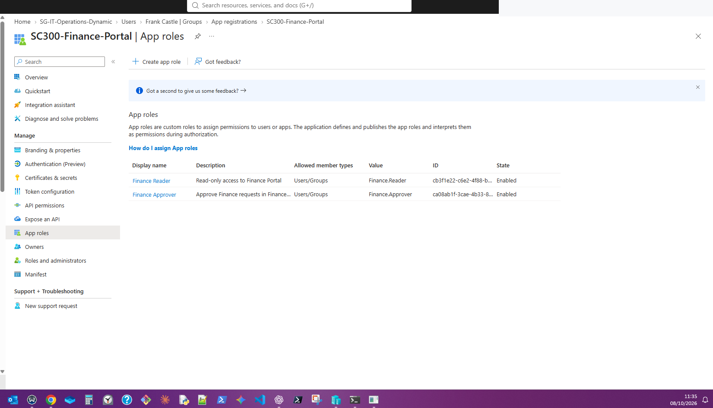
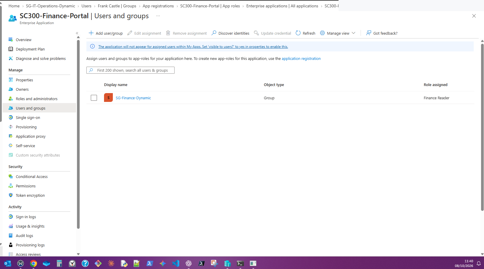
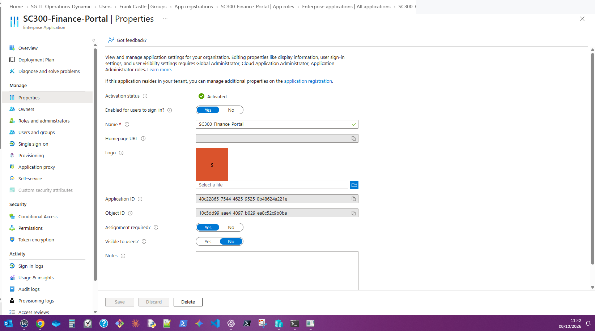
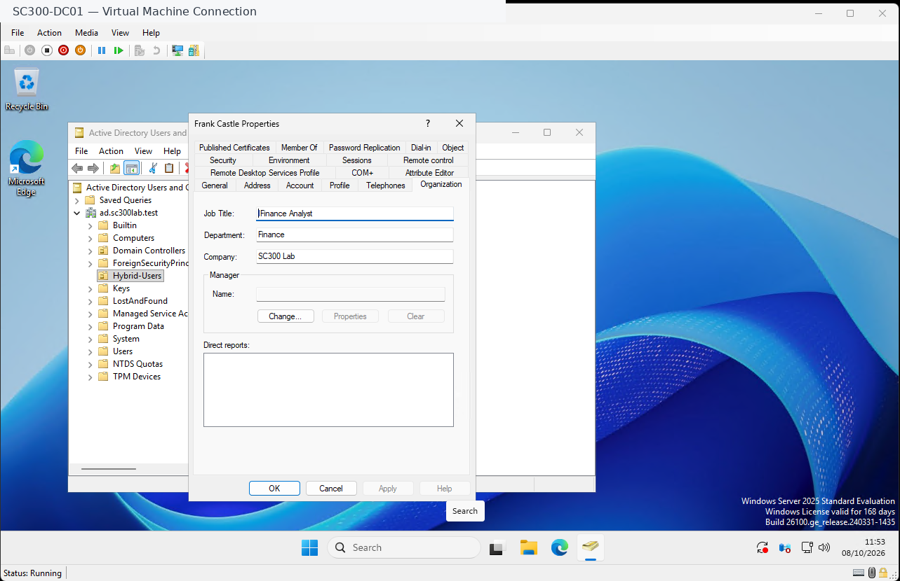
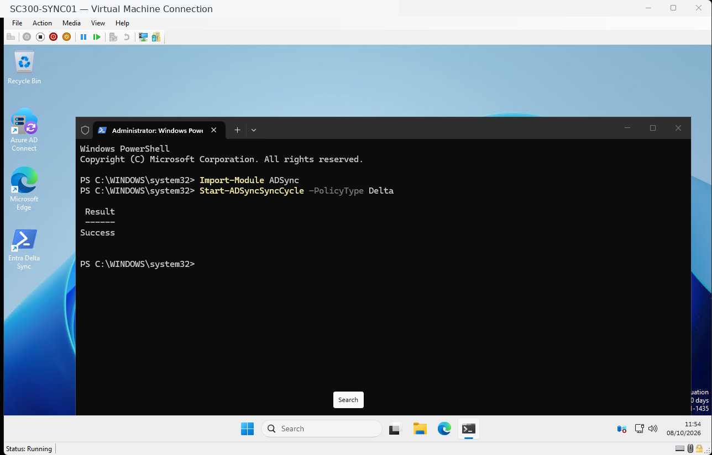
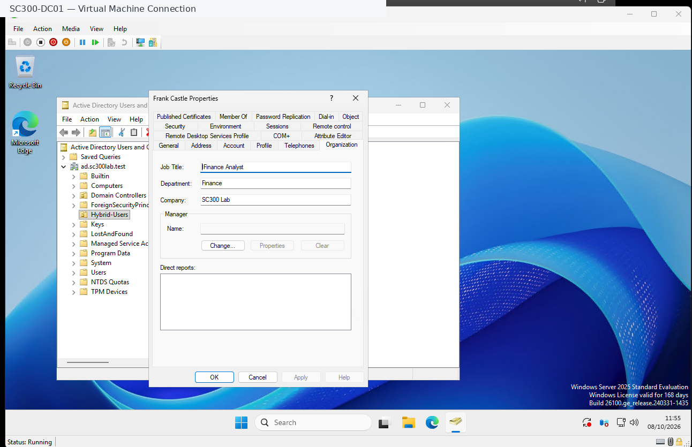
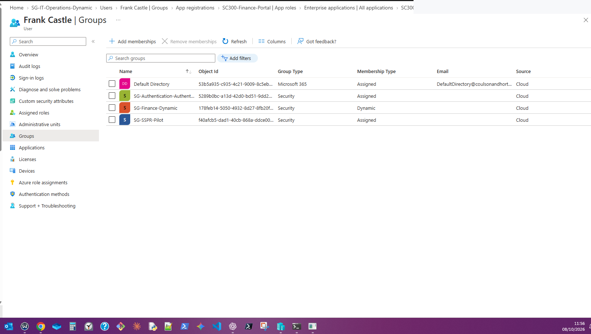
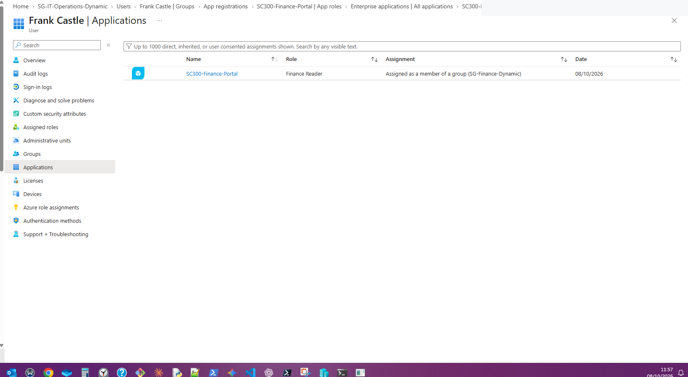
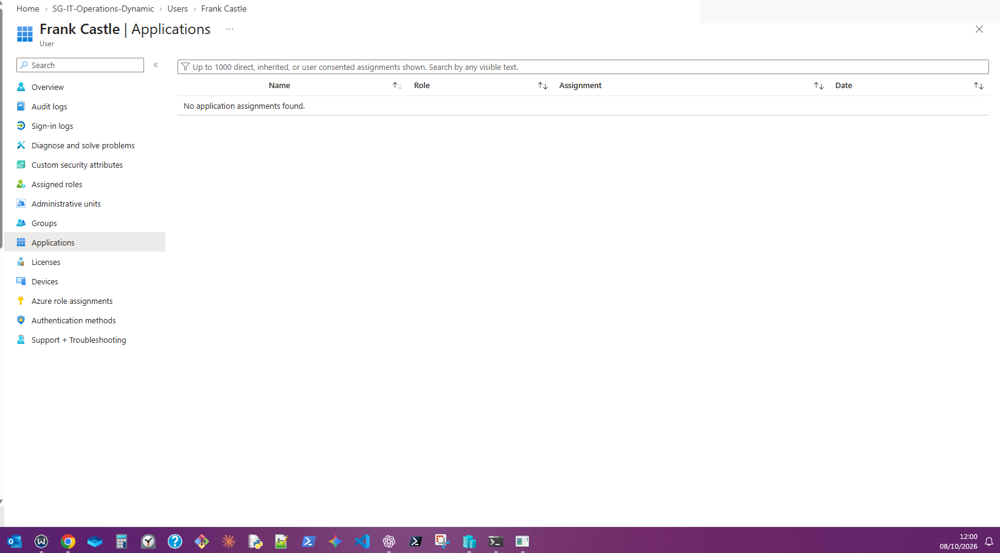

# 04 — Identity Governance and Application RBAC

**Lab:** SC-300 Hybrid Identity and Access Management  
**Test date:** 8 October 2026  
**Environment:** On-premises Active Directory Domain Services, Microsoft Entra Connect Sync, Microsoft Entra ID

## Objective

Demonstrate how an employee's authoritative department attribute in on-premises Active Directory can drive cloud dynamic security group membership and an inherited enterprise application role assignment, without directly assigning the user to the application. Validate both granting and removing the entitlement during a department transfer.

## Architecture

```text
Active Directory (SC300-DC01)
  Frank Castle — department attribute
       |
       v
Microsoft Entra Connect Sync (SC300-SYNC01)
       |
       v
Microsoft Entra ID user attributes
       |
       v
Dynamic security group: SG-Finance-Dynamic
  Rule: (user.department -eq "Finance")
       |
       v
Enterprise application: SC300-Finance-Portal
  Assigned application role: Finance Reader
```

## Configuration

### Dynamic security groups

| Group | Membership rule | Purpose |
| --- | --- | --- |
| `SG-IT-Operations-Dynamic` | `(user.department -eq "IT Operations")` | Department-based IT membership |
| `SG-Finance-Dynamic` | `(user.department -eq "Finance")` | Department-based Finance membership |

Membership is calculated by Entra ID based on synchronised user attributes; it is not manually maintained.

### Application registration and enterprise application

Created the single-tenant application registration **SC300-Finance-Portal**. Its enterprise application (service principal) was used for assigning access. The following application roles were defined:

| Role display name | Role value | Allowed members | Purpose |
| --- | --- | --- | --- |
| Finance Reader | `Finance.Reader` | Users/Groups | Intended read-only access |
| Finance Approver | `Finance.Approver` | Users/Groups | Intended approval access |

The enterprise application was configured with **Assignment required = Yes**, and `SG-Finance-Dynamic` was assigned **Finance Reader**. The Finance Approver role was not assigned to the Finance group.







## Test — Department transfer to Finance

1. In **SC300-DC01**, updated the test user's department to **Finance** and job title to **Finance Analyst**.
2. On **SC300-SYNC01**, triggered a manual delta synchronisation:

   ```powershell
   Import-Module ADSync
   Start-ADSyncSyncCycle -PolicyType Delta
   ```

3. The command returned `Success`, indicating the sync request was accepted. Subsequent Entra checks confirmed the expected identity/group changes.
4. In Entra ID, confirmed that Frank was a **dynamic member** of `SG-Finance-Dynamic` and the IT Operations dynamic group was no longer listed.
5. In **Frank Castle → Applications**, confirmed an inherited assignment to **SC300-Finance-Portal** with role **Finance Reader**, sourced from `SG-Finance-Dynamic`.

### Evidence — Finance access provisioned











## Test — Department transfer back to IT Operations

The test user was moved back to **IT Operations**, and synchronisation and dynamic group processing were allowed to complete. The user's **Applications** page subsequently displayed **No application assignments found**, where it had previously shown the Finance Reader role inherited from the Finance dynamic group.

### Evidence — Finance entitlement removed



> **Evidence boundary:** The final Applications screenshot verifies the inherited application entitlement is no longer listed. A separate final Groups screenshot is still recommended to independently confirm restored IT membership and removed Finance membership.

## Results

| Control / expected behaviour | Observation | Result |
| --- | --- | --- |
| AD department drives Finance dynamic group membership | Frank appeared in `SG-Finance-Dynamic` after sync | Verified |
| Finance group inherits Reader app role | Frank's Applications page showed **Finance Reader**, assigned as a member of `SG-Finance-Dynamic` | Verified |
| Finance Approver is not automatically assigned | No Approver assignment shown | Verified in reviewed assignment views |
| Removing Finance group eligibility removes the inherited entitlement | Frank's Applications page showed **No application assignments found** after the return to IT | Verified in Entra assignment view |
| Live application login / API authorisation | No working Finance Portal application or redirect URI was configured | Not tested |
| Existing session/token revocation | No active app session or token was exercised | Not tested |

## Security principles demonstrated

- **Least privilege:** Department-based access maps to Reader rather than Approver.
- **Separation of duties:** Approver is a separate app role, not bundled with Finance department membership.
- **Lifecycle automation:** An authoritative on-premises identity attribute feeds cloud group membership and inherited application entitlement.
- **Reduced privilege creep:** An entitlement can be withdrawn when the user no longer satisfies the group rule.
- **Auditability:** Screenshots capture the configuration and the observed before-and-after assignments.

## Limitations and next steps

This lab demonstrates **identity entitlement configuration and lifecycle**, not a functioning Finance Portal or enforced business permissions. The `Finance.Reader` and `Finance.Approver` values must be checked by application code, usually through a validated token's `roles` claim. Changes to Entra assignments do not necessarily invalidate already-issued tokens or active sessions immediately.

Recommended follow-up: build a small single-tenant OpenID Connect application, configure a redirect URI, test Reader and Approver authorisation, capture sign-in logs, and verify how assignment changes affect new sign-ins versus existing sessions.

## Evidence index

The `evidence/` directory also contains earlier configuration screenshots from the same lab session. All 36 files are retained for reference; the images above are the core evidence supporting this case study.

**Publication check:** Review every screenshot for visible account names, tenant domains, IDs, email addresses, and other information you do not want in a public repository. Header redaction alone is not a complete privacy review.
